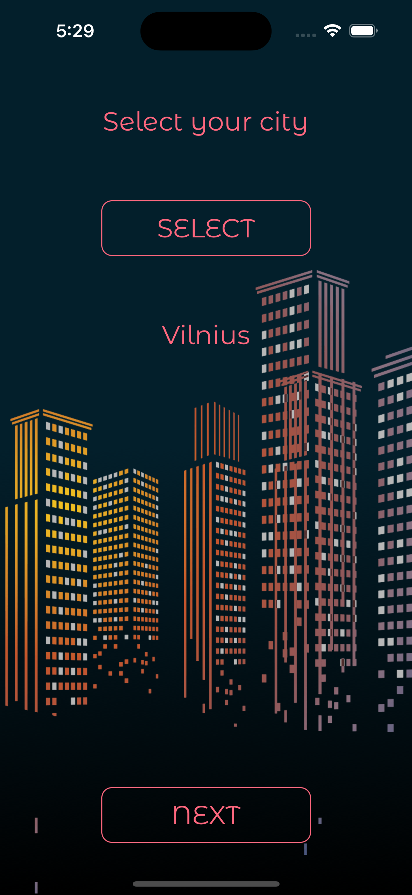
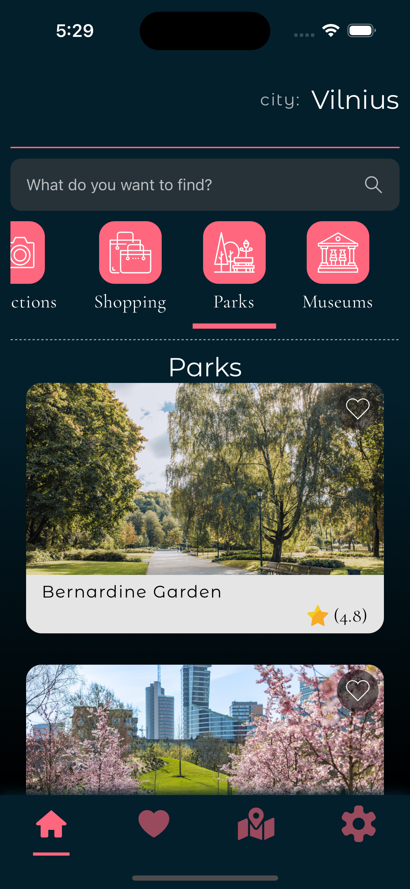
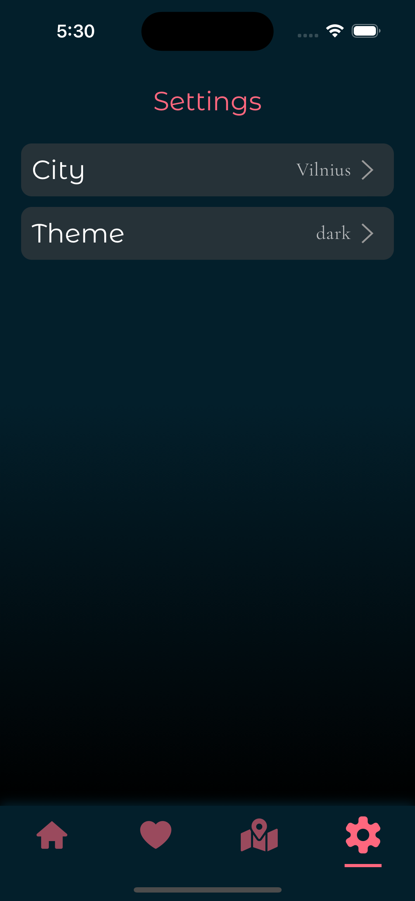

# 
 _*`City-Walking-Tours`*_ 

### Project

- This application will help you organize your trip the way it suits you.
- Plan your places to visit in advance, get to know popular tourist places, visit the best cafes and restaurants in the city, discover the most amazing parks, get to know the history of the city along with the best museums.
- Save your favorite places that you want to visit. Find out more about each location.
- You can find all the locations you need on the map.

#

## Work with:

- React-Native (with a focus on development for the iOS platform);
- Core Components, Tab Navigation, StyleSheet, animation;
- Firebase (Cloud Firestore, Storage);
- app icon, splash screen, onboarding, fonts;
- jest tests, snapshots, husky (pre-commit/pre-push hooks);
- mobx, react-context, AsyncStorage;
- sonarqube;
- libraries :
  - react-native-linear-gradient;
  - mobx/mobx-react;
  - react-native-svg;
  - react-native-maps;
  - react-native-splash-screen;
  - @react-navigation/bottom-tabs
  - @react-native-firebase/firestore;
  - @react-native-firebase/storage;
  - @react-native-community/geolocation;
  - @react-native-community/blu;
  - @types/react-test-renderer;
  - husky;
  - jest;

# 
Project visualization 

## 
Video visualization 

 <video src='./static/video_1.mp4' height='450' controls ></video> <video src='./static/video_2.mp4' height='450' controls ></video> <video src='./static/video_3.mp4' height='450' controls ></video> <video src='./static/video_4.mp4' height='450' controls ></video> <video src='./static/video_5.mp4' height='450' controls ></video> <video src='./static/video_6.mp4' height='450' controls ></video> <video src='./static/video_7.mp4' height='450' controls ></video>
 

# 

## 
Screenshots visualization 

### SplashScreen

#

  

### Onboarding

#

      

### CitySelectionScreen

#

     

### Main Content

#

    
        

### Light Theme

#

   
   
      

#
